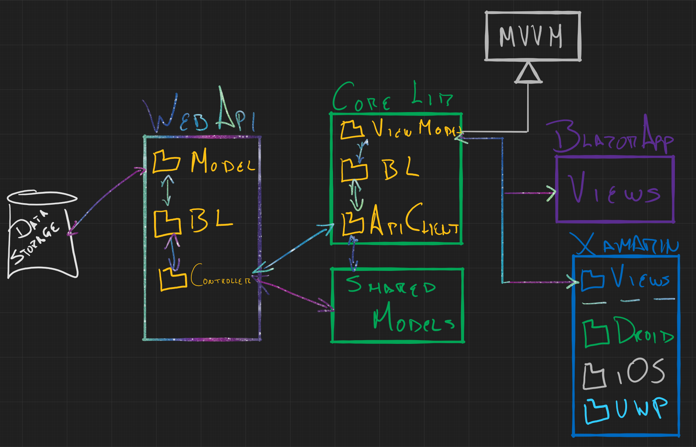

# MVVMUniversal

MVVM pattern for Blazor and Xamarin *and other clients*; sharing logic code,
businesses layers, WebAPI clients, and so on.

## Architecture

MVVMUniversal has 4 main layers:

1.  Backend
>WebAPI logic for response HTTP standard calls

2.  Shared API Model
>Structures for interchange data as parameters for WebAPI methods or as responses

3.  Core
>This is the most important layer, because requires and independent platform and Views code

    a.  MVVM
>Base classes for agnostic MVVM pattern, dependency service for DI and structures error handling

    b.  Logic library
>Logical code as WebAPI client, business layer, ViewModel and any platform agnostic code.

4.  Clients
    1.  Blazor App
    2.  Xamarin App
    3.  Any other compatible

